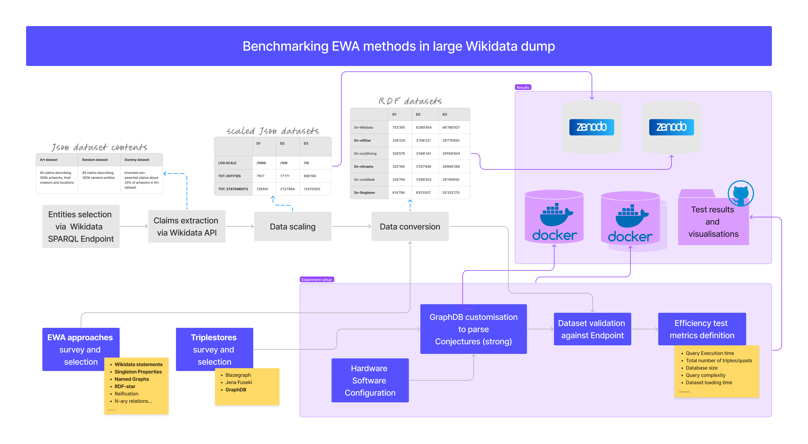

# Benchmarking Expressing Without Asserting methods on large Wikidata Dumps
## Notes on Efficiency Test setup and results



# Table of Contents
- [Data preparation](#data-preparation)
- [Hardware and Software Configuration](#hardware-and-software-configuration)
- [GraphDB costumisation and setup (to parse Conjectures)](#graphdb-costumisation-and-setup-to-parse-conjectures)
- [Metrics definition](#metrics-definition)
  - [Queries definition](#queries-definition)
- [Test results and visualisations](#test-results-and-visualisations)
  - [Test results](#test-results)
  - [Visualisations](#visualisations)
- [Experiment reproducibility on your local machine](#experiment-reproducibility-on-your-local-machine)

## Data preparation
This part of the workflow is documented in a separate repository available at [conjectures-rdf/expressing-without-asserting-efficiency-datasets](https://github.com/conjectures-rdf/expressing-without-asserting-efficiency-datasets)

## Hardware and Software Configuration
Tests have been run on a computer with processor Intel Core i5-8259U CPU @ 2.30GHz 2.30 GHz, RAM 32,0 GB, Windows 10 pro 64 bits, 1T hard disk. The TriG and SparQL parsers of our GraphDB engine were modified to parse Conjectures in strong form (see [next section](#graphdb-costumisation-and-setup)). The configuration of the GraphDB instance used for these experiments uses 28G Ram allocated to the application (for more information see [ref])(https://graphdb.ontotext.com/documentation/10.1/configuring-graphdb-memory.html), [ref](https://graphdb.ontotext.com/documentation/10.2/getting-started.html\#:\~:text=the\%20aforementioned\%20icon.-), (ref)[Configuring\%20the\%20JVM,Contents\%2Fapp\%2FGraphDB\%20Desktop]}, and 10G cache size. A repository has been created for each dataset with inferences off, no rule set assigned, predicates list index enabled and (when possible) contexts enabled. All other parameters are left in their default values. Repositories are already running before their performance tests are executed.

## GraphDB costumisation and setup (to parse Conjectures)
The complete documentation of GraphDB costumisation and setup can be found at: [GraphDB-conjectures-strong-parser](https://github.com/conjectures-rdf/GraphDB-conjectures-strong-parser)

## Metrics definition

### Queries definition
The following queries mimic all **Assertion status** which has been defined in [**Assertion vs. Non-assertion logic**](https://github.com/conjectures-rdf/expressing-without-asserting-efficiency-datasets). 

| Query | Predicate | Data selected by query |
|-------|-----------|------------------------|
| GQ1   | P170      | All attributions of artworks that are currently considered valid |
| GQ1   | P276      | All locations of artworks that are currently considered valid |
| GQ2   | P170      | All attributions of artworks that have been debated |
| GQ2   | P276      | All past and debated locations of artworks |
| GQ3   | P170      | All attributions of artworks that have been debated, *with provenance* |
| GQ3   | P276      | All past and debated locations of artworks, *with date of move* |
| GQ4   | P170      | All currently debated attributions of artworks |
| GQ4   | P276      | All locations of artworks whose current location is uncertain |
| GQ5   | P170      | All settled attributions of artworks |
| GQ5   | P276      | All current locations of artworks that were moved |
| GQ6   | P170      | All attributions of artworks that were never debated |
| GQ6   | P276      | All locations of artworks that never moved |
| FQ1   | P170      | All attributions of paintings (Q3305213) that currently are considered valid |
| FQ1   | P276      | All locations of paintings (Q3305213) that are currently considered valid |
| FQ2   | P170      | All attributions of paintings (Q3305213) that have been debated |
| FQ2   | P276      | All past and debated locations of paintings (Q3305213) |
| FQ3   | P170      | All attributions of paintings (Q3305213) that have been debated, *with provenance* |
| FQ3   | P276      | All past and debated locations of paintings (Q3305213), *with date of move* |
| FQ4   | P170      | All currently debated attributions of paintings (Q3305213) |
| FQ4   | P276      | All locations of paintings (Q3305213) whose current location is uncertain |
| FQ5   | P170      | All settled attributions of paintings (Q3305213) |
| FQ5   | P276      | All current locations of paintings (Q3305213) that were moved |
| FQ6   | P170      | All attributions of paintings (Q3305213) that were never debated |
| FQ6   | P276      | All locations of paintings (Q3305213) that never moved |

All queries in SPARQL are available in `queries` folder:
- `generale_queries.json` contains GQ\[1:6\] for both P170 and P276 properties
- `filtered_queries.json` contains FQ\[1:6\] for both P170 and P276 properties
- `GraphDB_query_runner.py` runs authomatically a selected json file

## Test results and visualisations
All contents are stored in the `results` folder.

### Test results
**Query responses** results are available in the `query_execution_response` folder, which contains two subfolders:
- `partial_results` contains 10 runs for each query
-  `final_results` contains the average of the 10 runs

### Visualisations
- All results visualisations are produced by `EWA_efficiency_charts.ipynb` 

## Experiment reproducibility on your local machine
To run the experiments take the following steps:
- Run locally one of the two available dockers:
  - ```docker push valentinamomo/conjectures-graphdb-ewa-rtr:1.0```: This docker is **ready to run (RTR)** and can be mounted locally in few minutes. It contains a customised instance of GraphDB to parse and read Conjectures and 10 preloaded datasets to compare its efficiency with concurrent approaches. In particular, this instance contains Wikidata statements, RDF-star, Named Graphs, Conjectures in Weak form, Conjectures in strong form each of which comes in two sizes (D1 and D2). It requires 20GB of free memory space to be used.
  - ```tbd```: This docker is **slow to run (STR)** and can be mounted locally in some hours. It contains a customised instance of GraphDB to parse and read Conjectures and 18 preloaded datasets to compare its efficiency with concurrent approaches. In particular, this instance contains Wikidata statements, RDF-star, Named Graphs, Singleton Properties, Conjectures in Weak form, Conjectures in strong form each of which comes in three sizes (D1, D2 and D3). It requires 0.5T of free memory space to be used.
  - Modifications of GraphDB instances in the dockers are stored in ```conjectures-extension-graphdb```

- Run locally the code provided in ```XXX``` and locate the ```queries``` in the same folder.
  - ```queries``` contains the set of queries designed for this experiment and the code to run them
  - ```query_exectution_response``` contains partial and final results of query runs which come from this test attempt.
