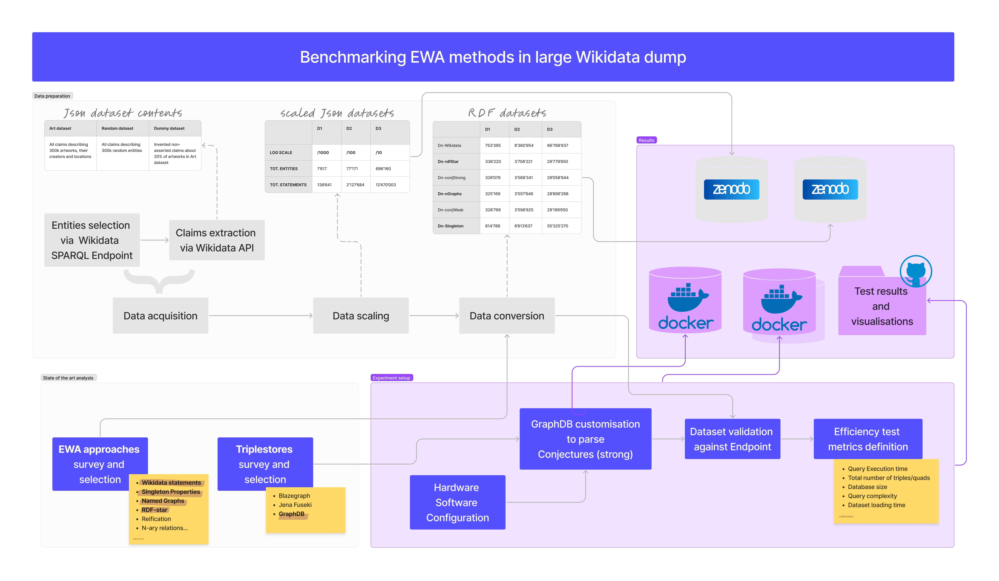

# EWA-efficiency

This repository contains all files to evaluate Expressing Without Asserting (EWA) approaches in RDF.



<!-- TOC start (generated with https://github.com/derlin/bitdowntoc) -->

- [EWA-efficiency](#ewa-efficiency)
   * [
   * [GraphDB costumisation and setup](#graphdb-costumisation-and-setup)

<!-- TOC end -->

<!-- TOC --><a name="ewa-efficiency"></a>

<!-- TOC --><a name="data-acquisition-scaling-and-conversion"></a>

## Data preparation
This part of the workflow is documented in a separate repository available at [conjectures-rdf/expressing-without-asserting-efficiency-datasets](https://github.com/conjectures-rdf/expressing-without-asserting-efficiency-datasets)

<!-- TOC --><a name="graphdb-costumisation-and-setup"></a>
## GraphDB costumisation and setup
The complete documentation of GraphDB costumisation and setup can be found at: [GraphDB-conjectures-strong-parser](https://github.com/conjectures-rdf/GraphDB-conjectures-strong-parser)

## Queries definition

The following queries mimic all **Assertion status** which has been defined in **Assertion vs. Non-assertion logic**. 

| Query | Predicate | Data selected by query |
|-------|-----------|------------------------|
| GQ1   | P170      | All attributions of artworks that are currently considered valid |
| GQ1   | P276      | All locations of artworks that are currently considered valid |
| GQ2   | P170      | All attributions of artworks that have been debated |
| GQ2   | P276      | All past and debated locations of artworks |
| GQ3   | P170      | All attributions of artworks that have been debated, *with provenance* |
| GQ3   | P276      | All past and debated locations of artworks, *with date of move* |
| GQ4   | P170      | All currently debated attributions of artworks |
| GQ4   | P276      | All locations of artworks whose current location is uncertain |
| GQ5   | P170      | All settled attributions of artworks |
| GQ5   | P276      | All current locations of artworks that were moved |
| GQ6   | P170      | All attributions of artworks that were never debated |
| GQ6   | P276      | All locations of artworks that never moved |
| FQ1   | P170      | All attributions of paintings (Q3305213) that currently are considered valid |
| FQ1   | P276      | All locations of paintings (Q3305213) that are currently considered valid |
| FQ2   | P170      | All attributions of paintings (Q3305213) that have been debated |
| FQ2   | P276      | All past and debated locations of paintings (Q3305213) |
| FQ3   | P170      | All attributions of paintings (Q3305213) that have been debated, *with provenance* |
| FQ3   | P276      | All past and debated locations of paintings (Q3305213), *with date of move* |
| FQ4   | P170      | All currently debated attributions of paintings (Q3305213) |
| FQ4   | P276      | All locations of paintings (Q3305213) whose current location is uncertain |
| FQ5   | P170      | All settled attributions of paintings (Q3305213) |
| FQ5   | P276      | All current locations of paintings (Q3305213) that were moved |
| FQ6   | P170      | All attributions of paintings (Q3305213) that were never debated |
| FQ6   | P276      | All locations of paintings (Q3305213) that never moved |


## Experiment reproducibility

To run the experiments take the following steps:
- Run locally one of the two available dockers:
  - ```docker push valentinamomo/conjectures-graphdb-ewa-rtr:tagname```: This docker is **ready to run (RTR)** and can be mounted locally in few minutes. It contains a customised instance of GraphDB to parse and read Conjectures and 10 preloaded datasets to compare its efficiency with concurrent approaches. In particular, this instance contains Wikidata statements, RDF-star, Named Graphs, Conjectures in Weak form, Conjectures in strong form each of which comes in two sizes (D1 and D2). It requires 20GB of free memory space to be used.
  - ```tbd```: This docker is **slow to run (STR)** and can be mounted locally in some hours. It contains a customised instance of GraphDB to parse and read Conjectures and 18 preloaded datasets to compare its efficiency with concurrent approaches. In particular, this instance contains Wikidata statements, RDF-star, Named Graphs, Singleton Properties, Conjectures in Weak form, Conjectures in strong form each of which comes in three sizes (D1, D2 and D3). It requires 0.5T of free memory space to be used.
  - Modifications of GraphDB instances in the dockers are stored in ```conjectures-extension-graphdb```

- Run locally the code provided in ```XXX``` and locate the ```queries``` in the same folder.
  - ```queries``` contains the set of queries designed for this experiment and the code to run them
  - ```query_exectution_response``` contains partial and final results of query runs which come from this test attempt.
